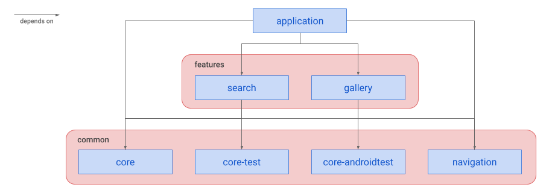
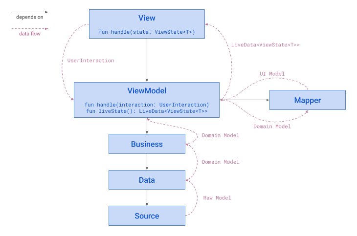

# Aviation Data

[](https://circleci.com/gh/vinicius-pmoleta/aviation-data)

## About

Aviation Data is an app to study and apply modern Android development practices, libraries and tendencies.

The app is structured to be multi-module and leverage `Kotlin Coroutines` in a MVVM architecture with states and Android Architecture Components (`AACs`).

## Overview

The app consists in two screens, one to search and list for aircraft based on its model or registration and another to see a gallery with the selected aircraft photos.

In order to provide the above-mentioned information the [OpenSky Network](https://opensky-network.org/) API was used to provide the search results and the [JetPhotos](https://www.jetphotos.com/) was used to provide the photo gallery.

## Modules



### Common

The common modules are a set of modules that can be reused across many different modules, each one with its specific purpose.

The `core` module contains the main parts needed to create a feature such as:
- Base DI structure used and extended by feature modules
- Common extension functions
- Contracts
- Common models
- Common views reusable across the modules
- Helper functions
- Base resources such as styles, themes, colors and dimensions

The `core-test` module is supposed to hold common test code such as helpers and rules to facilitate unit tests in other modules.

The `core-androidtest` module is supposed to hold common test code such as helpers, rules and robots to facilitate instrumented tests in other modules.

The `navigation` module, as the name says, is responsible for navigation across feature in the app by using the `Navigation AAC`. This means that each feature module doesn't need to know about other features, it just needs to request the navigation module to perform an action leaving to the navigation module to decide the destination such as another feature.

The downside of this approach is when creating the xml files for the navigation graphs the name of the entry point feature fragment doesn't contain auto-complete on Android Studio and it's also not recognized by the IDE, being marked as an error, since the `navigation` module can't know about the feature modules. However, once the APK is assembled the references to the fragments are then known and the navigation works as expected. Considering the benefits of being able to use the `Navigation` AAC and also have a module dedicated only for this purpose, I believe it was worth the downside for the moment.

### Feature

A feature module was designed to be an Android Library that makes use of the common modules when needed. It groups one or more screens that logically makes sense to be together.

At the moment it doesn't make use of the `Android Dynamic Modules` from which dynamic feature deliver and smaller APKs could be leverage. The reason for that is that I couldn't make it work properly with the unit and instrumented tests in a multi-module architecture. In order to proceed with other study topics I decided to address it in a later moment, but an initial attempt to use them can be found at this [branch](https://github.com/vinicius-pmoleta/aviation-data/tree/improvement/adding-dynamic-modules).

Each feature module relies on the usage of `Kotlin Coroutines`, `Kodein DI` and a MVVM architecture with states and AACs such as `ViewModel` and `LiveData`.

The option to use the `Kotlin Coroutines` instead of the common approach to use `RxJava` as an attempt to simplify multi-threading operations which very often can lead to very complicated data streams that are hard to understand, debug and maintain. In this specific study project there wasn't the need of a data stream across different layers so it was one more reason `Kotlin Coroutines` was chosen over `RxJava`, but if there was a need for data stream a study and attempt would be also made with the recent `Kotlin Flow` to compare its pros and cons against `RxJava`.

Another decision made was to use `Kodein` instead of the common approach to use `Dagger`. Again one of the reasons to choose Kodein is to explore less verbose options which can provide similar capabilities and also allow an easier injection override on tests to allow screen and integration tests. 

#### Structure



The base idea behind the architecture adopted is that each feature or each screen of a feature would respect the same communication contract between the `View` and the `ViewModel`. In order to do so it uses this [contract](https://github.com/vinicius-pmoleta/aviation-data/blob/master/common/core/src/main/java/com/aviationdata/common/core/structure/Contract.kt) defined which exposes the `ViewModel`'s state as a `LiveData` and allows it to handle user interactions, while the `View` should be responsible to render the ready to consume state provided and changed by the `ViewModel`.   

The `ViewModel` is responsible for handling user's interaction and address them accordingly orchestrating threads for background work, calling the appropriate business logic and also mapping the results from that layer into models that will are ready to be consumed by the `View` once exposed through its state. One thing important to notice is that the `ViewModel` also does the error handling by catching the exceptions that other layers might have thrown when performing their operations.

The `business layer` as explained before is responsible for performing the business logic associated with specific use cases of the feature while having the support of the `data layer` where operations such as networking, database access, etc are performed. It's worth noticing that on the data layer there's also appropriate mapping from raw to domain models to return to the business layer only information relevant to it.

#### Tests

Each feature has tests to verify the `View`'s behaviour through an instrumented test with a mocked `ViewModel`. On these tests all the states the view consumes can be properly verified as well as the interactions and its internal data when communication with the mocked `ViewModel`.

By mocking the data layer source it's also possible to write tests that check the whole feature flow up to the data source interaction. In this project the APIs data sources were mocked using the `MockWebServer` library, validating the submitted request and its payload and mocking the response. 

The `ViewModel`, mappers, and logic presented on the business and data layers can be unit tested with jUnit and Mockito.

### Application

This is the main app module, which due to the decision of making the feature modules as Android libraries, will depend on the the feature modules as well as some common modules such as `core` and `navigation`.

As a consequence of using the `Navigation AAC`, the application module is where the main `Activity` which will host the feature fragments and `Toolbar` is configured and initialized.

## Building and running

By running the script `./build.sh` it will:
- run static checks (Ktlint and Detekt)
- run unit tests
- assemble a debug APK

To run the instrumented tests execute: `./gradlew connectedCheck`

## Resources

While studying and building this application many different videos and blog posts were very useful and inspirational:
- [_**DroidCon Berlin 2019 - Developing Themes with Style**_ by Nick Butcher & Chris Banes](https://droidcon.com/media-detail?video=352671629)
- [_**Modularization - Lessons learned**_ by Jeroen Mols](https://jeroenmols.com/blog/2019/06/12/modularizationtips)
- [_**Norris App**_ by Ubiratan Soares](https://github.com/dotanuki-labs/norris)
- [_**Dependency injection in a multi module project**_ by Ben Weiss](https://medium.com/androiddevelopers/dependency-injection-in-a-multi-module-project-1a09511c14b7)
- [_**Android Architecture**_ by Philippe Boisney](https://proandroiddev.com/android-architecture-d7405db1361c)
- [_**Coroutines on Android Series**_ by Sean McQuillan](https://medium.com/androiddevelopers/coroutines-on-android-part-i-getting-the-background-3e0e54d20bb)
- [_**Deep diving into the Kotlin Coroutines API**_ by Filip Babić](https://www.droidcon.com/media-detail?video=352671093)

## License

```
MIT License

Copyright (c) 2019 Vinicius Pilot Moleta

Permission is hereby granted, free of charge, to any person obtaining a copy
of this software and associated documentation files (the "Software"), to deal
in the Software without restriction, including without limitation the rights
to use, copy, modify, merge, publish, distribute, sublicense, and/or sell
copies of the Software, and to permit persons to whom the Software is
furnished to do so, subject to the following conditions:

The above copyright notice and this permission notice shall be included in all
copies or substantial portions of the Software.

THE SOFTWARE IS PROVIDED "AS IS", WITHOUT WARRANTY OF ANY KIND, EXPRESS OR
IMPLIED, INCLUDING BUT NOT LIMITED TO THE WARRANTIES OF MERCHANTABILITY,
FITNESS FOR A PARTICULAR PURPOSE AND NONINFRINGEMENT. IN NO EVENT SHALL THE
AUTHORS OR COPYRIGHT HOLDERS BE LIABLE FOR ANY CLAIM, DAMAGES OR OTHER
LIABILITY, WHETHER IN AN ACTION OF CONTRACT, TORT OR OTHERWISE, ARISING FROM,
OUT OF OR IN CONNECTION WITH THE SOFTWARE OR THE USE OR OTHER DEALINGS IN THE
SOFTWARE.
```